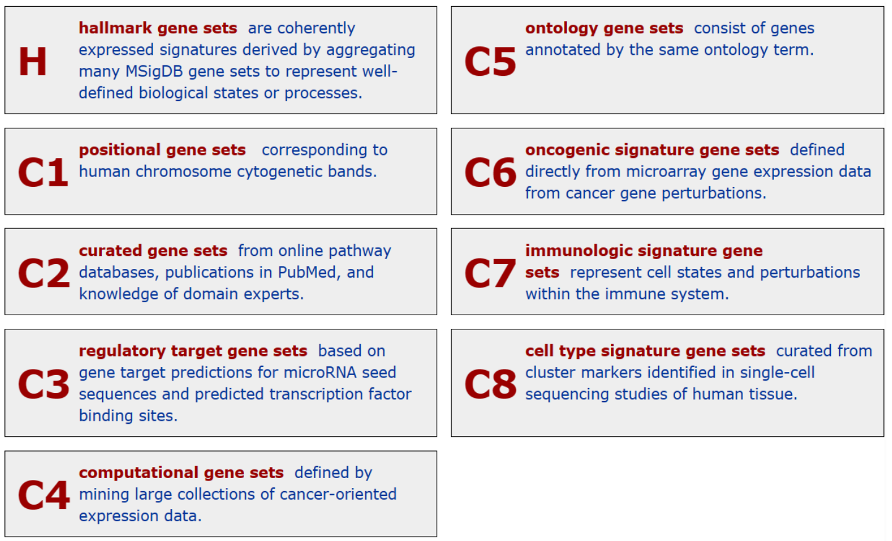
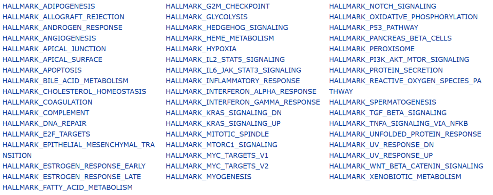
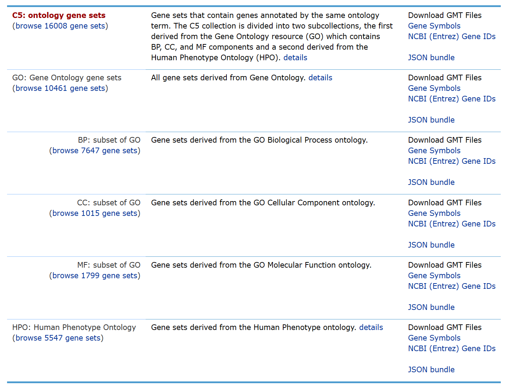
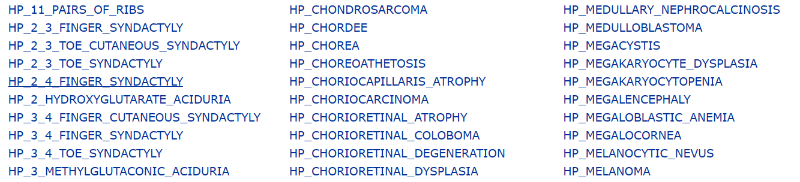
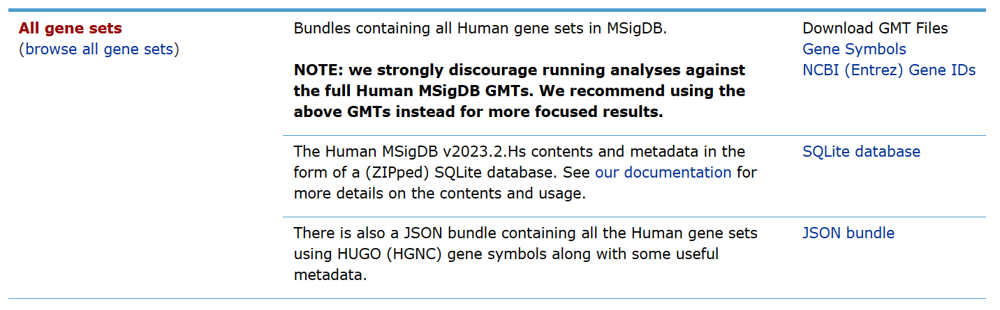
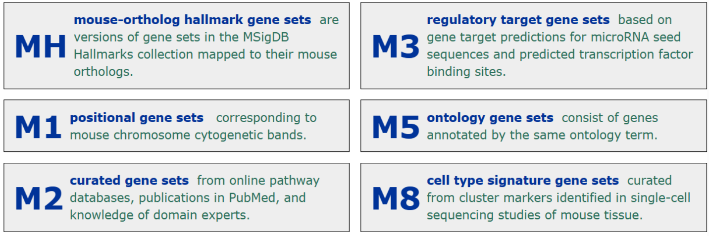

# MSigDB数据库

##  GSEA和MSigDB的概念

GSEA，Gene Set Enrichment Analysis，基因集富集分析。

MSigDB，分子特征数据库(Molecular Signatures Database )  
是数以万计的带注释基因集的资源，可与GSEA软件一起使用，分为人类和小鼠集合。网站链接：[MSigDB数据库](https://www.gsea-msigdb.org/gsea/msigdb/index.jsp)

进行GSEA分析的时候，其实就是将MSigDB中的基因集用来对样本的基因表达矩阵进行评估，目的是探究哪些通路（或基因集）表达上调，哪些下调。这个过程可以用GSEA软件实现（没试过），也可以通过`GSEA`的R包实现，而在进行富集分析的时候并不是使用全部的基因集，需要选择用MSigDB数据库中一个分类。

## 人类基因集（Human Collections）

### ==**H**：hallmarker gene sets （50 gene sets）==

（效应）特征基因集合，总结整理的是特定的明确定义的生物状态或过程的基因集合，它包含由多个已知的基因集构成的去冗余的、高质量的，经典的功能基因集，有50个基因集。

### **C1**：positional gene sets (301 gene sets)

 与基因在染色体上的位置相关的基因集合，根据不同染色体编号进行二级分类

> cytogenetic band是染色体上区分的特定区域，用于描述染色体的结构和位置。通常包含（1）染色体号，（2）臂的符号，（3）区号，（4）该带在所属区的带号。这四部分需要连续列出，中间不要有空格和间断。例如1p31表示1号染色体短臂3区1带。
>
> p和q分别用于表示染色体的短臂和长臂。着丝粒区定义为1区0带，即为10；向着短臂部分称为p10，面向长臂的部分称为q10。每条臂上与着丝粒相连的部分定义为1，稍远的区定义为2，依次类推。

### ==**C2**：curated gene sets (7233 gene sets，常用)==

基因集来源是已知数据库、文献和专家支持等。C2集合细分成化学及遗传扰动CGP（Chemical and genetic perturbations）和经典信号通路CP（Canonical pathway）两个子集。**像是KEGG、Reactome、WikiPathways这些都有！**

C2基因集的特点包括：

1. **精心筛选**：这些基因集经过专家手动筛选，通常具有较高的质量和可靠性。研究人员会根据特定的生物学过程、信号通路或疾病进行选择和编辑。
2. **多样性**：C2基因集涵盖了多个生物学领域和研究主题，例如细胞信号传导、代谢通路、疾病标记等，因此具有较广泛的应用范围。
3. **文献支持**：很多C2基因集的形成是基于文献报道和专家知识，这些基因集通常具有较好的生物学解释性，并且可以帮助研究人员理解基因与生物学过程之间的关联。

### C3: regulatory target gene sets （3713 gene sets）

即调控靶基因集。这些基因集主要包含了被已知转录因子或miRNA调控的基因，是通过基因表达调控网络、ChIP-seq（染色质免疫共沉淀测序）和其他实验技术来鉴定的。C3基因集用于研究基因调控网络、理解转录因子和miRNA在生物学过程中的作用，以及揭示其在疾病发生和发展中的作用。

C3基因集的特点包括：

1. **基因调控网络**：这些基因集反映了基因调控网络中转录因子和miRNA的作用。通过研究这些调控关系，可以深入了解基因的转录调控机制，以及转录因子和miRNA在调节基因表达中的作用。
2. **多种来源**：C3基因集来自于多种实验技术和研究资源，包括ChIP-seq、转录因子结合位点分析、miRNA靶点预测等。这些基因集覆盖了不同类型的调控关系，有助于全面理解基因调控网络的复杂性。
3. **疾病相关**：一些C3基因集可能与疾病发生和发展相关联，因为转录因子和miRNA在调控基因表达中的异常活动常常与疾病的发生和进展密切相关。因此，研究这些调控靶基因集可以帮助揭示疾病的发病机制，并寻找潜在的治疗靶点。

### C4: computational gene sets （1007 gene sets）

即计算基因集。这些基因集通常是通过计算方法从大规模基因表达数据或其他生物信息学数据中推导出来的。C4基因集涵盖了各种不同的生物学特性和过程，并且可以帮助研究人员理解基因在生物学上的功能和相互关系。

C4基因集的特点包括：

1. **数据驱动**：C4基因集是通过计算方法从大规模生物信息学数据中推导出来的，例如基因表达数据、蛋白质互作网络数据、基因组序列数据等。这些基因集的形成通常基于统计学或机器学习算法，以发现基因之间的模式和关联。
2. **全面性**：由于C4基因集是基于大规模数据分析得出的，因此它们通常具有较高的覆盖范围和全面性，涵盖了多个生物学过程和功能模块。这些基因集有助于全面理解基因的功能和相互作用。
3. **生物学解释性**：尽管C4基因集是通过计算方法推导而来的，但它们仍然具有生物学解释性。研究人员可以通过分析这些基因集来揭示基因之间的生物学关系，探索基因在细胞过程和信号通路中的功能。
4. **应用广泛**：C4基因集可用于各种生物学研究，包括基因功能分析、生物标记鉴定、疾病机制研究等。它们为研究人员提供了一个重要的工具，用于挖掘和理解基因的生物学意义和功能。

### ==**C5: ontology gene sets**（16008 gene sets，常用）==

即本体基因集。这些基因集主要基于基因本体论（Gene Ontology，GO）项目的分类体系。GO是一个标准化的生物信息学工具，用于描述基因和蛋白质的功能。GO分为三个主要方面：分子功能（Molecular Function）、生物过程（Biological Process）和细胞组分（Cellular Component）。C5基因集包含了基于这些GO分类的基因集合，以及它们之间的关联信息。

C5基因集的特点包括：

基于标准化分类：C5基因集基于GO项目的标准化分类体系，涵盖了基因和蛋白质在分子功能、生物过程和细胞组分等方面的各种功能和特性。
生物学解释性：由于C5基因集是基于GO分类体系的，因此具有很强的生物学解释性。研究人员可以通过分析这些基因集来理解基因在生物学过程中的功能和参与程度。
覆盖广泛：C5基因集覆盖了多个生物学领域和研究主题，涵盖了许多不同类型的生物学过程、分子功能和细胞组分。这使得它们在各种生物学研究中具有广泛的应用价值。
可靠性：GO项目是一个广泛接受和使用的标准化生物信息学资源，因此C5基因集通常具有较高的可靠性和信赖度。

#### ==C5中的HPO（Human Phenotype Ontology）==

是指人类表型本体论，它是==一种用于描述人类表型（phenotype）的标准化分类系统==。人类表型指的是个体在形态、生理和行为等方面观察到的可测量的特征，包括外部表现和内部生理特征。HPO通过定义术语和术语之间的关系来描述和组织这些人类表型，从而形成一个结构化的分类体系。

在C5基因集中，HPO基因集包含了与人类表型相关的基因集合。这些基因集可能与特定的人类表型相关联，例如遗传性疾病、先天性异常等。研究人员可以使用HPO基因集来探索基因与人类表型之间的关联，以及理解这些关联与疾病发生和发展之间的关系。

HPO基因集的特点包括：

1. **与人类疾病相关**：HPO基因集通常与特定的人类疾病或表型相关联。这些基因集可能包含与遗传性疾病、发育异常等相关的基因，有助于理解基因与疾病表型之间的关系。
2. **标准化分类**：HPO采用标准化的术语和分类体系来描述人类表型，因此HPO基因集具有一定的标准化和统一性。这使得研究人员可以更容易地对基因与表型之间的关系进行比较和分析。
3. **生物医学研究应用**：HPO基因集在生物医学研究中具有广泛的应用价值，包括疾病诊断、基因功能研究、疾病模型建立等方面。通过研究基因与特定表型之间的关系，可以深入了解疾病的发病机制和生物学特征。

### C6: oncogenic signature gene sets（189 gene sets）

即致癌基因签名基因集。这些基因集包含了与肿瘤发生和发展相关的基因签名，这些基因签名通常反映了肿瘤细胞的特征、恶性程度、治疗敏感性等方面的信息。C6基因集的来源包括从肿瘤细胞系、肿瘤组织和临床样本中获得的基因表达数据，以及与肿瘤相关的文献报道和实验研究。

C6基因集的特点包括：

1. **肿瘤特异性**：C6基因集包含了与肿瘤发生和发展密切相关的基因签名，这些基因签名通常具有肿瘤特异性。这些基因集可以帮助研究人员理解肿瘤细胞的特征和分子机制，以及揭示肿瘤发展的关键因素。
2. **生物学解释性**：C6基因集中的基因签名通常反映了肿瘤细胞的生物学特征和活动。通过分析这些基因签名，可以深入了解肿瘤细胞的信号通路、生长控制机制、侵袭和转移能力等方面的生物学过程。
3. **临床意义**：C6基因集中的基因签名通常与肿瘤的临床特征、治疗敏感性和预后相关。因此，这些基因集可以用于预测肿瘤患者的治疗反应、预后评估以及肿瘤的分类和分期。
4. **治疗靶点发现**：通过分析C6基因集中的基因签名，可以发现潜在的肿瘤治疗靶点和新的治疗策略。这些基因集有助于揭示肿瘤细胞的易感性和耐药机制，为开发新的治疗方法提供线索和指导。

### **C7: immunologic signature gene sets**（5219 gene sets）

即免疫学特征基因集。这些基因集包含了与免疫系统功能和活动相关的基因签名，涵盖了免疫细胞类型、免疫反应通路以及免疫相关的生物学过程。C7基因集通常来自于免疫学研究、免疫相关疾病的研究以及免疫治疗的研究。

C7基因集的特点包括：

1. **免疫特异性**：C7基因集中的基因签名通常与免疫系统功能和活动密切相关。这些基因集包含了免疫细胞的特征、免疫反应的调节因子、免疫相关通路的调节因子等，有助于理解免疫系统在健康和疾病状态下的功能。
2. **生物学解释性**：C7基因集中的基因签名反映了免疫系统的生物学特征和活动。通过分析这些基因签名，可以深入了解免疫系统的调节机制、免疫反应的调控因子以及免疫相关疾病的发病机制。
3. **临床意义**：C7基因集中的基因签名通常与免疫相关疾病的发生、发展和治疗反应相关。这些基因集可以用于预测免疫相关疾病的发病风险、评估免疫治疗的疗效以及开发新的免疫治疗策略。
4. **免疫治疗指导**：通过分析C7基因集中的基因签名，可以发现潜在的免疫治疗靶点和新的治疗策略。这些基因集有助于揭示免疫系统的异常活动和免疫耐受机制，为开发新的免疫治疗方法提供线索和指导。

### **C8: cell type signature gene sets**（830 gene sets）

即细胞类型特征基因集。这些基因集包含了与不同细胞类型相关的基因签名，反映了不同细胞类型的特征和功能。C8基因集通常来自于单细胞RNA测序数据、细胞系列数据以及细胞标记物的研究。

C8基因集的特点包括：

1. **细胞特异性**：C8基因集中的基因签名通常与特定的细胞类型相关。这些基因集可以帮助研究人员区分不同类型的细胞，理解它们的功能和相互关系。
2. **生物学解释性**：C8基因集中的基因签名反映了不同细胞类型的生物学特征和功能。通过分析这些基因签名，可以深入了解不同细胞类型的特异性表达基因、信号通路和功能模块。
3. **临床意义**：C8基因集中的基因签名通常与疾病发生和发展相关。一些基因签名可能与特定类型的肿瘤细胞相关，而其他基因签名可能与正常细胞的功能失调或疾病的发展相关。
4. **治疗靶点发现**：通过分析C8基因集中的基因签名，可以发现潜在的治疗靶点和新的治疗策略。这些基因集有助于揭示不同细胞类型在疾病发生和发展中的作用，为开发新的治疗方法提供线索和指导。

### **All gene sets**

注意：官方强烈反对针对完整的人类MSigDB GMT运行分析（虽然可以）。建议根据需求使用上述GMT来获得更集中的结果。

## 小鼠的基因集（Mouse Collections）

小鼠的基因集来源类似于人类。

### MH: hallmark gene sets （50 gene sets）

基本特征基因集。这些基因集来自于Molecular Signatures Database的原创内容，代表了一系列基因表达模式，通常与生物学过程和疾病相关。"MH"基因集包含了一系列关键的生物学特征，如细胞周期、DNA修复、免疫应答等。

### **M1: positional gene sets**（341 gene sets）

即位置基因集。这些基因集是根据基因在染色体上的位置或特定染色体区域的分布而定义的。

### **M2: curated gene sets**

这些基因集是经过专家筛选和编辑的，通常来自于文献报道、专家知识和公共数据库等多个来源。M2基因集涵盖了多个生物学领域和研究主题，具有较高的质量和可靠性。

### M3: regulatory target gene sets (2048 gene sets)

即调控目标基因集。这些基因集包含了被已知转录因子或miRNA调控的基因。调控目标基因集是通过基因表达调控网络、ChIP-seq（染色质免疫共沉淀测序）和其他实验技术来鉴定的。

### **M5: ontology gene sets**（10754 gene sets）

基因本体论

### **M8: cell type signature gene sets**（ 233 gene sets）

细胞类型
