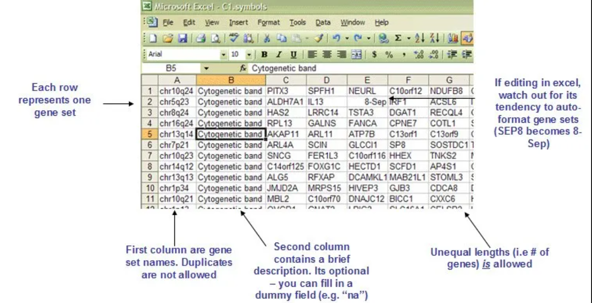
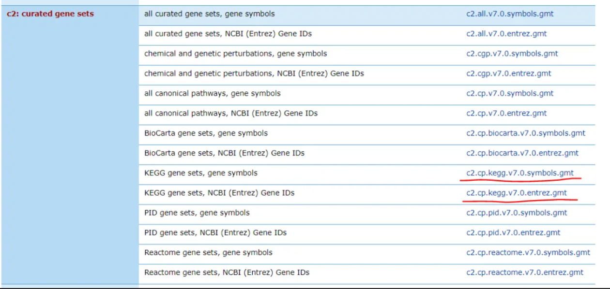
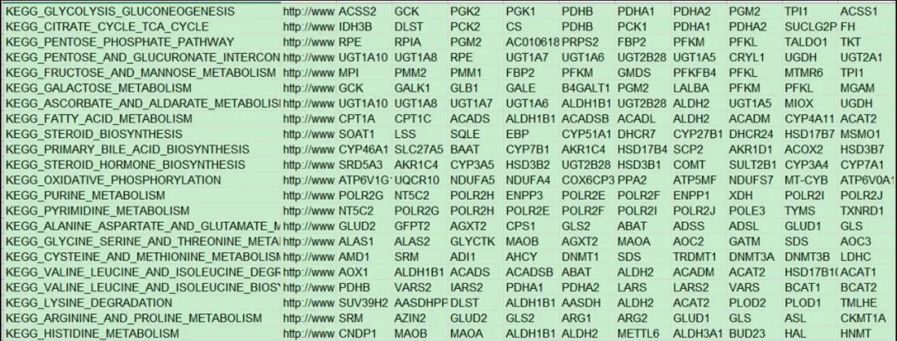
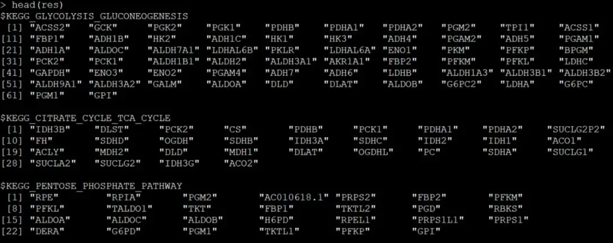
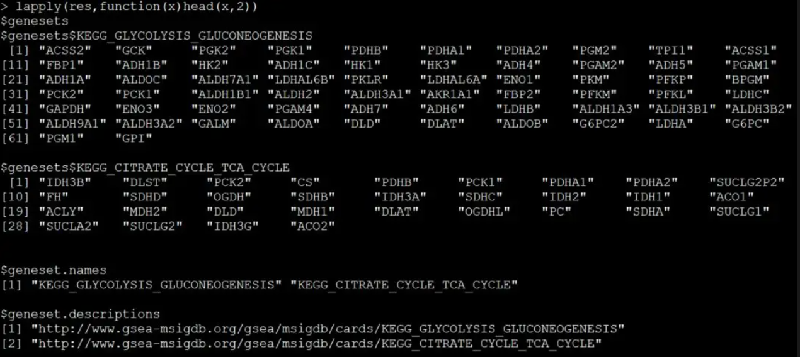

# R读取基因矩阵转置文件格式（* .gmt）

## 认识gmt数据格式

gmt（Gene Matrix Transposed，基因矩阵转置）文件，里面保存的是一些基因列表的信息。每一行代表一个基因列表，基因之间以制表符隔开。下面是一个gmt文件的示例。第一列是基因列表的名字，第二列一般是描述信息，说明这套基因列表从哪里收集的，也可以为空或者用NA表示。从第三列开始，每一列是一个基因的名字。每一行的长度可以不一致，也就是说每一个基因列表中包含的基因数可以不一样。



在GSEA的官网上（https://www.gsea-msigdb.org/gsea/downloads.jsp）

将所有的基因集划分为几个大类，具体可参照 之前的笔记：[MSigDB数据库](https://github.com/woodpeckerdk/woodpeckerdk.github.io/blob/main/%E7%94%9F%E4%BF%A1%E7%AC%94%E8%AE%B0/MSigDB%E6%95%B0%E6%8D%AE%E5%BA%93.md)

## 用R读取gmt文件

首先我们从GESA(https://www.gsea-msigdb.org/gsea/downloads.jsp)的官网上，下载一个gmt文件。这里以KEGG的gmt文件为例，其他gmt文件的读取方法一样。



c2.cp.kegg.v7.0.symbols.gmt这个文件里面保存的是基因的名字



而c2.cp.kegg.v7.0.entrez.gmt这个文件里面保存的是基因的Entrez gene id

下面我们会用两种不同的方法来将KEGG symbol的gmt文件读到R里，并转换成列表。由于gmt文件的每一行都是不一样长的，所以传统的read.table在这里是毫无用武之地的。

### 方法一：

```R
    x <- readLines("c2.cp.kegg.v7.0.symbols.gmt")
    res <- strsplit(x, "\t")
    names(res) <- vapply(res, function(y) y[1], character(1))
    res <- lapply(res, "[", -c(1:2))
```

该方法会将KEGG通路的名字作为列表中每个元素的名字，然后将前两列删掉，剩下的基因名字作为列表的元素。

> 

### 方法二：

```R

   dat = readLines("c2.cp.kegg.v7.0.symbols.gmt")
    n = length(dat)
    res = list(genesets = vector(mode = "list", length = n), 
        geneset.names = vector(mode = "character", length = n), 
        geneset.descriptions = vector(mode = "character", 
            length = n))
    for (i in 1:n) {
        s = strsplit(dat[i], "\t")[[1]]
        res$genesets[[i]] = s[-c(1:2)]
        res$geneset.names[i] = s[1]
        res$geneset.descriptions[i] = s[2]
    }
    names(res$genesets) = res$geneset.names
    res
```

该方法，会保留gmt文件中的所有信息，结果会生成一个复杂的数据结构，列表里面嵌套列表。res为列表，长度为3，分别保存genesets，KEGG通路名字和数据来源，而geneset也是一个列表，里面保存186条KEGG通路上的所有基因名字


